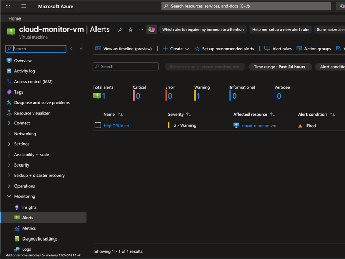
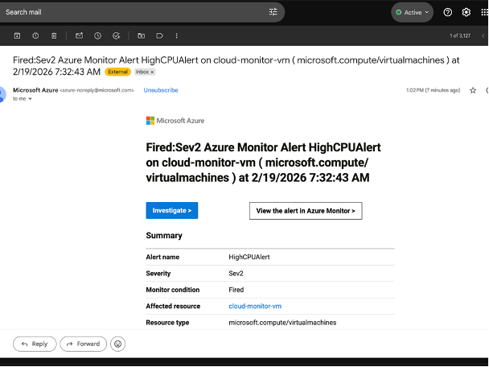

# Hybrid Cloud Monitoring and Alerting System

This project implements a hybrid cloud monitoring solution by combining Microsoft Azure Monitor with custom Python scripts. It provides both infrastructure-level and operating system-level monitoring to detect performance issues and security threats in real time.

## Overview

Cloud platforms like Azure offer strong infrastructure monitoring, but they often lack detailed visibility into system-level activities such as login attempts or deep resource usage.

This project bridges that gap by:

* Using Azure Monitor for cloud-level metrics
* Using Python scripts for OS-level monitoring
* Automating execution using cron jobs

The result is a more complete and practical monitoring system similar to real-world DevOps setups.

## Features

* Monitoring of CPU, memory, and disk usage
* Detection of failed login attempts (security monitoring)
* Real-time alerts using Azure Monitor
* Automated execution using cron jobs
* Lightweight and efficient system

## System Architecture

The system follows a layered approach:

* Azure Virtual Machine (Ubuntu)
* Azure Monitor for infrastructure-level tracking
* Python scripts for OS-level monitoring
* Cron jobs for automation
* Email alerts for notifications

## Tech Stack

* Cloud Platform: Microsoft Azure
* Operating System: Ubuntu Server
* Programming Language: Python 3
* Libraries: psutil
* Tools: Azure Monitor, Cron (Linux scheduler)

## Project Structure

hybrid-cloud-monitoring-system/
│── cpu_monitor.py
│── memory_monitor.py
│── disk_monitor.py
│── login_monitor.py
│── README.md
│
├── docs/
│   ├── abstract.pdf
│   ├── project_report.pdf
│
├── screenshots/
│   ├── azure_alert.png
│   ├── cpu_output.png

## How It Works

1. Azure Monitor tracks VM-level metrics
2. Python scripts collect system-level data
3. Cron jobs execute scripts at regular intervals
4. Threshold conditions are checked
5. Alerts are triggered when anomalies are detected

## Setup Instructions

Clone the repository:

git clone https://github.com/abhiram3023/hybrid-cloud-monitoring-system.git
cd hybrid-cloud-monitoring-system

Install dependencies:

pip install psutil

Run scripts manually:

python3 cpu_monitor.py
python3 memory_monitor.py

## Cron Automation

To automate execution:

crontab -e

## Screenshots

### Azure Alert

### CPU Monitoring Output

## Documentation

Abstract and full project report are available in the docs/ folder.

## Results

* Successfully monitored CPU, memory, and disk usage
* Detected unauthorized login attempts
* Generated real-time alerts using Azure
* Automated monitoring without manual intervention

The hybrid approach proved more effective than using cloud monitoring alone.

## Limitations

* Requires manual setup
* Limited visualization compared to advanced tools
* Basic alerting system

## Future Improvements

* Dashboard integration (Grafana / Power BI)
* AI-based anomaly detection
* Centralized monitoring for multiple systems
* Integration with Slack or Teams

## Team

* Abhiram Majeti
* Swaran Chandra
* Sai Aditya Rao

## Conclusion

This project demonstrates how combining cloud-native tools with custom scripting can create a more complete monitoring solution. It reflects real-world practices used in DevOps and cloud operations.
